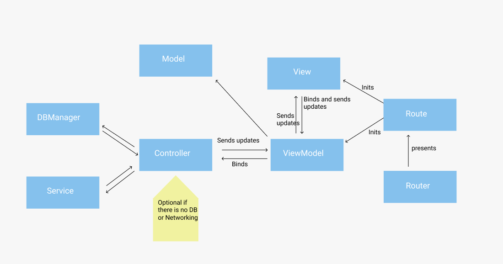

Swift Base Project
============================================

The goal of this project is to work as a template for iOS aplications, providing a base architecture, core frameworks and helpers to jumpstart development.

# Base tooling

- `R.Swift` for xcode asset management.
- `SwiftLint` for style checking.
- `RxSwift` for data flow management.
- `Alamofire` + `TBD` for networking.
- `RealmSwift` + `RxRealm` for database management.
- `Whisper` for in app notification-style messages.

# Usage

## Option #1: Copy the core files to your project
If you already have a running project and you want to use this project's core modules, you can just copy the source files into your project which are available in the `/Core` folder.
This can come in handy in projects where you want to start by refactoring some parts of the code and not starting from scratch again.

## Option #2: Start from scratch

1. Clone this repository to your machine.
2. Change the git project remote url to one of your own with `git remote set-url origin https://github.com/USERNAME/REPOSITORY.git`.
3. Make all the scheme, target and ids changes so it has all the necesary information about your app.

    - Change all schemes to be named after your new project.
    - Change the bundle id to one of your own.
    - Set up certificates (or let xcode do it automatically).
    - Update the `TargetType+BaseProject.swift` to be named after your project.
    - Check the `Constants.swift` file and update the `baseUrl` propperties to point to your backend services.

4. Go to your `Podfile` and change the target names to the new ones that you have set up.
5. Run `pod repo update` and `pod install`.
6. Build both targets to see if everything is running OK.

## Configuring Development and Production Flags

[Check this article](https://kitefaster.com/2016/01/23/how-to-specify-debug-and-release-flags-in-xcode-with-swift/)

TL;DR:
1. Open your Project Build Settings and search for “Swift
2. Compiler – Custom Flags” … “Other Swift Flags”.
3. Add “-DDEBUG” to the Debug section
Add “-DRELEASE” to the Release section

# Architecture

We are going to use MVVM + R, with some caveats:

## Models
The models won't store business logic. They will only act as data stores (Realm objects if you are using a local DB, Structs otherwise).

## Views
The `Views` (or `ViewControllers` in this case) only responsability will be displaying the data provided by its `ViewModel`, and forwarding all events to their respective `ViewModel`.

## ViewModel
The `ViewModel` is the component in charge of managing the state of each view, and any processing necesary of the data to be displayed / submitted.

Moreover, the VM communicates with `Controllers` to fetch the data necessary for its view. And with its `Coordinator` to forward navigation events.

## Controllers, Services and DataManagers
The `Controllers` are in charge of managing the `Models`. This means that ideally you should have one `Controller` per `Model` (unless you need something like a session controller that can manage more than one type users, and session info for example).

The `Controllers` use 2 support classes, `Services` and `DataManagers`, one for networking access and other for Database respectively. If you don't have one of them (apps that only consume API data for example and don't save nothing locally) You can replace your `Controller` with a `Service` or `DataManager` and use that directly in your `ViewModel`.

## Router
The router is the component in charge of handling the navigation stack of your entire application. For this matter, the router keeps track of your `rootViewController` and your `currentViewController` (the currently visible one).

To keep things tidy and isolated, the router does not know how to instantiate the screens that it presents. This is defined separately using the `Route` protocol. A `Route` is a component that encapsulates all the necessary logic to instantiate a `view`, with it's corresponding `viewModel` and any other parameters forwarded from other routes.
Apart from the `Route`, you can set a `TransitionType` when you navigate to a route, this tells the navigator how the screen should be presenter (modally, pushed, resetting the stack, etc.).

So, to call a navigation action, the only thing we need to do is to call our Application's `Router` and call `.navigate` with the corresponding `Route` and `TransitionType`, as simple as that.

